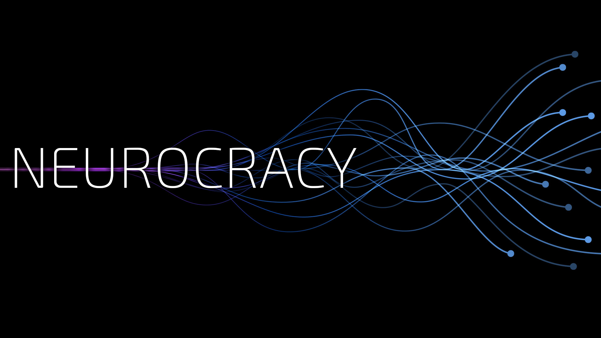

⚠️⚠️⚠️ ***Here be potential spoilers. Proceed at your own risk.*** ⚠️⚠️⚠️

----

# Why open source?

We're dismayed by how much knowledge and technology is kept under lock and key
in the videogame industry, with years of work often never seeing the light of
day when projects are cancelled. We've gotten to where we are by building upon
the work of countless others, and we want to keep that going. We hope that some
part of this codebase is useful or will inspire someone out there.
